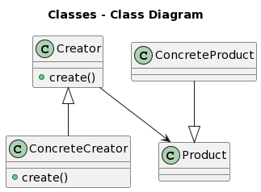
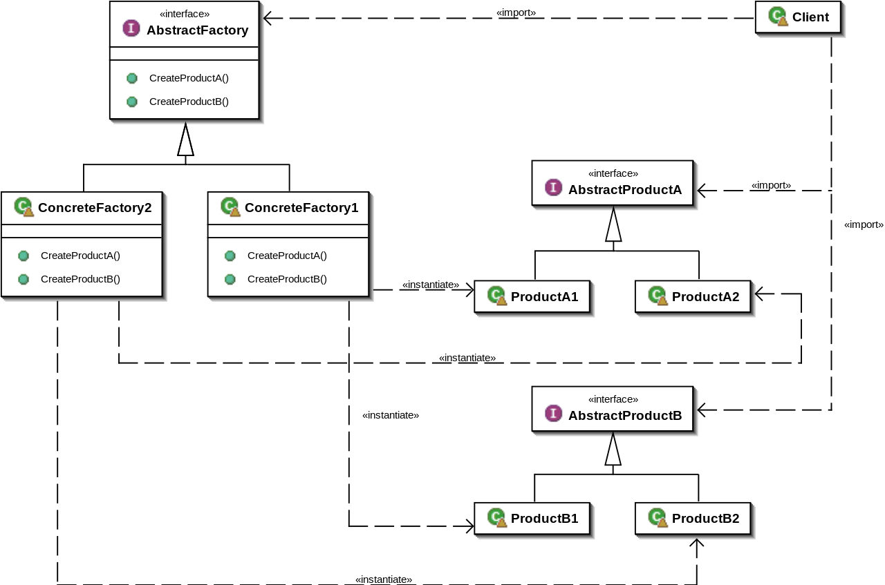
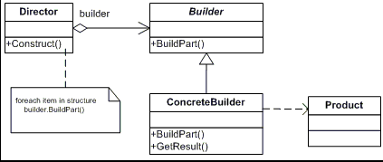
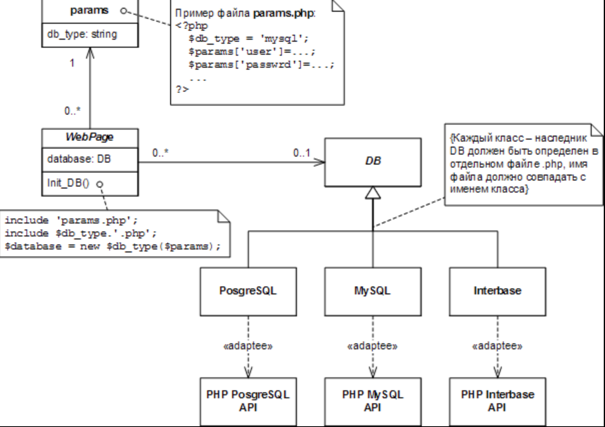

# Лекции ООП

* __Лекция 11__
  
    Приведение типов с помощью `static_cast, dynamic_cast, ...`,
    шаблон фабричный метод

## Шаблоны 
Шаблон (паттерн) - готовое решение, но его приходится адаптировать под 
конкретную задачу. При использовании паттернов код становится более читаемый 
-> проще взаимодействовать с коллегами.

UML диаграмма классов - диаграмма сущностей и связей между сущностями.

|<имя>|
|---|
|- <поля> |
|+ <методы>|
 
Связи можем разделить на 4 вида.
1. Зависимость - - -> (одна сущность зависит от другой (изменение одной сущности
   может влиять на другую))
2. Ассоциация  -----> (делится на несколько вариантов: 
   агрегация < >--->(), композиция (<->--->) (один объект создает в себе
   элементы другого)
3. Наследование (делится на обощение ------<> и реализацию , - - - -<>)

Можно разделить паттерны на
- Архитектурные
- Пораждающие
- Поведения
- Структурные

## Порождающие паттерны

При проектировании системы стоит четко выделять сущности, которые отвечают
за создание объектов. Кроме того, почти везде стоит выделять отдельную 
сущность которая принимает решение какой объект создавать

### Фабричный метод

#### Проблема
При модификации программы при необходимости подмены один оббъект на другой 
при импользовани стандартного способа 

```A *p = new B``` 

необходимо найти все места создания объекта (изменять много кода)
#### Идея
Делегировать создание объекта вспомогательному классу, тем самым сможем
расширять функционал без изменения уже написанного кода.

Кроме того, добавим также класс который будет принимать решение о создании
объекта во время выполнения программы.
#### UML 


#### Реализация
Самая простая реализация, но лучше использовать `unique_ptr/shared_ptr`
```c++
#include <iostream>

class Product
{
public:
    virtual void doSomething() = 0;
    virtual ~Product() = default;
};

class ConcreteProduct : public Product
{
public:
    void doSomething() override { std::cout << "Something concrete is done\n"; }
};

class Creator
{
public:
    virtual Product* create() = 0;
    virtual ~Creator() = default;
};

class ConcreteCreator : public Creator
{
public:
    Product* create() override { return new ConcreteProduct(); }
};

int main()
{
    ConcreteCreator cr = ConcreteCreator();
    Product *prod = cr.create();

    prod->doSomething();
}

```

#### Особенности
- Стоит отметить, что при использовании фабричного метода появляется 
  необходимость в сущности, которая решает какой объект создавать.
  На UML это можно отметить как еще один класс `Solution`, использующий 
  `Creator`.
- В `Solution` может быть добавлена таблица на основе данных в которой может 
  приниматься решение (не особо понял)

### Абстрактная фабрика
#### Проблема
Допустим мы используем библиотеку для отрисовки графиков, но в один момент 
ее надо заменить на другую. Хотелось бы делать это не изменяя написанный код 
и не выискивая все применения одной библиотеки
#### Идея
Выделить абстрактного создателя, который по запросу `Solution` будет 
создавать нужную сущность (при этом сущности могут быть не родственными)
но должны быть объеденены общим интерфейсом. 
#### UML

#### Реализация
```c++
#include <iostream>

class Engine
{
public:
    virtual void info() = 0;
    virtual ~Engine() = default;
};
class BmwEngine : public Engine
{
public:
    void info() override { std::cout << "BMW ENGINE\n"; }
};
class MercedesEngine : public Engine
{
public:
    void info() override { std::cout << "MERCEDES ENGINE\n"; }
};

class Wheel
{
public:
    virtual void info() = 0;
    virtual ~Wheel() = default;
};

class BmwWheel : public Wheel
{
public:
    void info() override { std::cout << "BMW WHEEL\n"; }
};

class MercedesWheel : public Wheel
{
public:
    void info() override { std::cout << "MERCEDES WHEEL\n"; }
};

class AbstractCarFactory
{
public:
    virtual Engine* createEngine() = 0;
    virtual Wheel* createWheel() = 0;
    virtual ~AbstractCarFactory() = default;
};

class MercedesCarFactory : public AbstractCarFactory
{
public:
    Engine* createEngine() override { return new MercedesEngine; }
    Wheel* createWheel() override { return new MercedesWheel; }
};

class BmwCarFactory : public AbstractCarFactory
{
public:
    Engine* createEngine() override { return new BmwEngine; }
    Wheel* createWheel() override { return new BmwWheel; }
};

class CarSolution
{
public:
    CarSolution(std::string config)
    {
        if (config == "BMW") creator = new BmwCarFactory;
        else if (config == "MERCEDES") creator = new MercedesCarFactory;
        else throw;
    }
    ~CarSolution() { delete creator; };

    AbstractCarFactory *getCreator() { return creator; }

private:
    AbstractCarFactory *creator;
};

int main()
{
    CarSolution solver = CarSolution("BMW");

    Engine *eng = solver.getCreator()->createEngine();
    Wheel* wheel = solver.getCreator()->createWheel();

    eng->info();
    wheel->info();

    delete eng;
    delete wheel;

    CarSolution newSolver = CarSolution("MERCEDES");

    eng = newSolver.getCreator()->createEngine();
    wheel = newSolver.getCreator()->createWheel();

    eng->info();
    wheel->info();

    delete eng;
    delete wheel;

    return 0;
}
```

### Прототип

#### Проблема
Чтобы в каком-то месте создать объект нужно передать фабрику
(протащить через весь код).
#### Идея
Создать объект на основе существующего.
Для этого добавим метод `clone` в интерфейс базового класса.
#### UML
Тривиальна
#### Реализация
```c++
#include <iostream>

class Phone
{
public:
    virtual void call() = 0;
    virtual Phone *clone() = 0;
    virtual ~Phone() = default;
};

class ApplePhone : public Phone
{
public:
    void call() override { std::cout << "CALLING\n"; }
    Phone* clone() override { return new ApplePhone(*this); }
};

int main()
{
    Phone *phone = new ApplePhone();
    phone->call();

    Phone *newPhone = phone->clone();
    newPhone->call();

    return 0;
}
```

### Строитель
#### Проблема
Некоторые объекты сложно создавать "за раз", из-за чего хочется 
выпонять их создание по частям
#### Идея
Разбить создание объекта на несколько частей, при этом поручив 
директору определять порядок выполнения
#### UML

#### Реализация
```c++
#include <iostream>
#include <memory>

class Car
{
public:
    void setEngine(std::string eng) { engine = eng; }
    void setBody(std::string b) { body = b; }
    void info() { std::cout << engine << std::endl << body << std::endl; }
private:
    std::string engine;
    std::string body;
};

class CarBuilder
{
public:
    virtual void buildEngine() = 0;
    virtual void buildBody() = 0;

    void createNewCar() { car = std::make_shared<Car>(); }
    std::shared_ptr<Car> getCar() { return car; }
protected:
    std::shared_ptr<Car> car;
};

class BmwCarBuilder : public CarBuilder
{
public:
    void buildEngine() override { car->setEngine("BMW engine"); }
    void buildBody() override { car->setBody("BMW body"); }
};

class MercedesCarBuilder : public CarBuilder
{
public:
    void buildEngine() override { car->setEngine("MERCEDES engine"); }
    void buildBody() override { car->setBody("MERCEDES body"); }
};

class Manufacturer
{
public:
    void setBuilder(CarBuilder *newBuilder) { builder = newBuilder; }
    std::shared_ptr<Car> buildCar() {
        if (!builder) throw;

        builder->createNewCar();
        builder->buildEngine();
        builder->buildBody();

        return builder->getCar();
    }
private:
    CarBuilder *builder;
};

int main()
{
    Manufacturer carProducer;
    carProducer.setBuilder(new MercedesCarBuilder);
    auto car = carProducer.buildCar();
    car->info();

    carProducer.setBuilder(new BmwCarBuilder);
    auto newCar = carProducer.buildCar();

    newCar->info();

    return 0;
}
```
#### Особенности
- Интерфейс директора может быть совместим с интерфейсом фабричного метода

### Одиночка
#### Проблема
Хотим чтобы объект какого-то класса мог быть создан только один раз.
#### Идея
Жестко контролировать процесс создания объекта
#### UML
Может быть много, зависит от ревлизации
#### Реализация
Может быть много
#### Особенности
- При одной из стандртных реализаций мы получаем доступ к объекту на 
уровне класса, тем самым объект получается около глобальным, что плохо.

### Пул объектов
#### Проблема
Одна из возможных - необхоимость обработки большого количества данных 
оптимально (загркзить процесор по максимуму лучшим количеством потоков)
#### Идея
Делегировать создание объектов стороннему классу (пулу) и брать 
объекты для выполнения операций над ними из него.


## Структурные паттерны
### Адаптер
#### Проблема
Есть несколько классов с несовместимыми интерфейсами, но которые делают
похожие вещи (например, есть несколько библиотек для взаимодействия с 
разными базами данных). Таким образом без применения данного паттерна 
приходится привязываться к конкретной реалзации библиотек.

Также мотивацией может быть необъимость импользовать один и тот же объект
в разных частях программы в не одинаковом по смыслу виде.
#### Идея
Подвести все библиотеки под общий интерфейс
#### UML

#### Реализация
```c++
#include <iostream>

class MySqlConnection
{
public:
    void mySqlInsert() { std::cout << "MY SQL INSERT\n"; }
};

class PostgreSqlConnection
{
public:
    void postgresInsert() { std::cout << "POSTGRES INSERT\n"; }
};

class BaseConnection
{
public:
    virtual void insert() = 0;
};


class MySqlAdapter : public BaseConnection
{
public:
    MySqlAdapter() { connection = new MySqlConnection; }
    void insert() override { connection->mySqlInsert(); }

private:
    MySqlConnection *connection;
};

class PostgresAdapter : public BaseConnection
{
public:
    PostgresAdapter() { connection = new PostgreSqlConnection; }
    void insert() override { connection->postgresInsert(); }

private:
    PostgreSqlConnection *connection;
};

int main()
{
    BaseConnection *connection = new PostgresAdapter();
    connection->insert();

    connection = new MySqlAdapter;
    connection->insert();

    return 0;
}

```
#### Особенности 
- Также применятся при расширении интерфейса, чтобы избежать приведение 
  типов
### 
