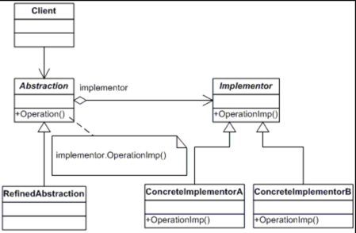
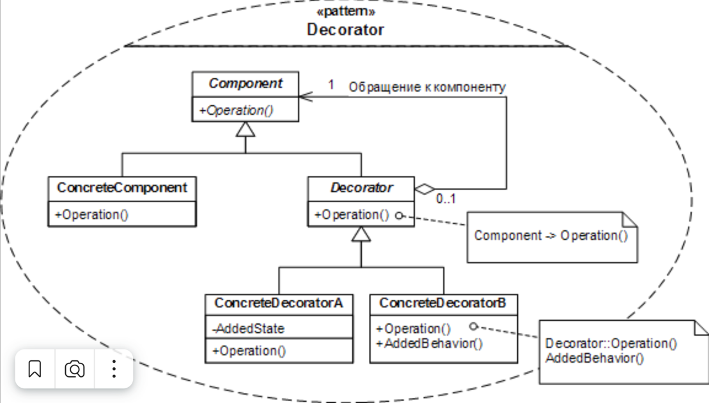
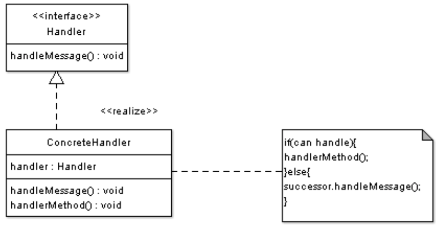
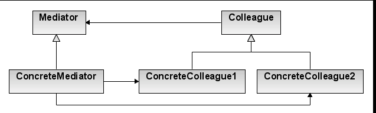
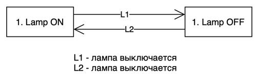
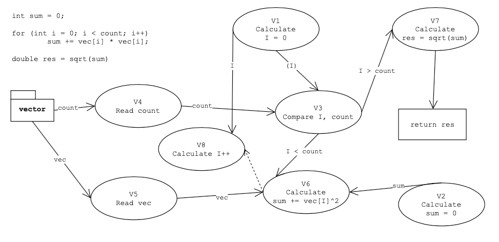

# Лекции ООП

* __Лекция 11__
  
    Приведение типов с помощью `static_cast, dynamic_cast, ...`,
    шаблон фабричный метод

* __Лекция 12__

  Паттерны

* __Лекция 13__

  Анекдот про возрастающий ряд

* __Лекция 14__

  Анекдот про бобров на 2:10

* __Лекция 16__

  Анекдот "Забыл достать" на 17:50

## Шаблоны 
Шаблон (паттерн) - готовое решение, но его приходится адаптировать под 
конкретную задачу. При использовании паттернов код становится более читаемый 
-> проще взаимодействовать с коллегами.

UML диаграмма классов - диаграмма сущностей и связей между сущностями.

|<имя>|
|---|
|- <поля> |
|+ <методы>|
 
Связи можем разделить на 4 вида.
1. Зависимость - - -> (одна сущность зависит от другой (изменение одной сущности
   может влиять на другую))
2. Ассоциация  -----> (делится на несколько вариантов: 
   агрегация < >--->(), композиция (<->--->) (один объект создает в себе
   элементы другого)
3. Наследование (делится на обощение ------<> и реализацию , - - - -<>)

Можно разделить паттерны на
- Архитектурные
- Порождающие
- Поведения
- Структурные

## Порождающие паттерны

При проектировании системы стоит четко выделять сущности, которые отвечают
за создание объектов. Кроме того, почти везде стоит выделять отдельную 
сущность которая принимает решение какой объект создавать

### Фабричный метод

#### Проблема
При модификации программы при необходимости подмены один оббъект на другой 
при импользовани стандартного способа 

```A *p = new B``` 

необходимо найти все места создания объекта (изменять много кода)
#### Идея
Делегировать создание объекта вспомогательному классу, тем самым сможем
расширять функционал без изменения уже написанного кода.

Кроме того, добавим также класс который будет принимать решение о создании
объекта во время выполнения программы.
#### UML 


#### Реализация
Самая простая реализация, но лучше использовать `unique_ptr/shared_ptr`
```c++
#include <iostream>

class Product
{
public:
    virtual void doSomething() = 0;
    virtual ~Product() = default;
};

class ConcreteProduct : public Product
{
public:
    void doSomething() override { std::cout << "Something concrete is done\n"; }
};

class Creator
{
public:
    virtual Product* create() = 0;
    virtual ~Creator() = default;
};

class ConcreteCreator : public Creator
{
public:
    Product* create() override { return new ConcreteProduct(); }
};

int main()
{
    ConcreteCreator cr = ConcreteCreator();
    Product *prod = cr.create();

    prod->doSomething();
}

```

#### Особенности
- Стоит отметить, что при использовании фабричного метода появляется 
  необходимость в сущности, которая решает какой объект создавать.
  На UML это можно отметить как еще один класс `Solution`, использующий 
  `Creator`.
- В `Solution` может быть добавлена таблица на основе данных в которой может 
  приниматься решение (не особо понял)

### Абстрактная фабрика
#### Проблема
Допустим мы используем библиотеку для отрисовки графиков, но в один момент 
ее надо заменить на другую. Хотелось бы делать это не изменяя написанный код 
и не выискивая все применения одной библиотеки
#### Идея
Выделить абстрактного создателя, который по запросу `Solution` будет 
создавать нужную сущность (при этом сущности могут быть не родственными)
но должны быть объеденены общим интерфейсом. 
#### UML

#### Реализация
```c++
#include <iostream>

class Engine
{
public:
    virtual void info() = 0;
    virtual ~Engine() = default;
};
class BmwEngine : public Engine
{
public:
    void info() override { std::cout << "BMW ENGINE\n"; }
};
class MercedesEngine : public Engine
{
public:
    void info() override { std::cout << "MERCEDES ENGINE\n"; }
};

class Wheel
{
public:
    virtual void info() = 0;
    virtual ~Wheel() = default;
};

class BmwWheel : public Wheel
{
public:
    void info() override { std::cout << "BMW WHEEL\n"; }
};

class MercedesWheel : public Wheel
{
public:
    void info() override { std::cout << "MERCEDES WHEEL\n"; }
};

class AbstractCarFactory
{
public:
    virtual Engine* createEngine() = 0;
    virtual Wheel* createWheel() = 0;
    virtual ~AbstractCarFactory() = default;
};

class MercedesCarFactory : public AbstractCarFactory
{
public:
    Engine* createEngine() override { return new MercedesEngine; }
    Wheel* createWheel() override { return new MercedesWheel; }
};

class BmwCarFactory : public AbstractCarFactory
{
public:
    Engine* createEngine() override { return new BmwEngine; }
    Wheel* createWheel() override { return new BmwWheel; }
};

class CarSolution
{
public:
    CarSolution(std::string config)
    {
        if (config == "BMW") creator = new BmwCarFactory;
        else if (config == "MERCEDES") creator = new MercedesCarFactory;
        else throw;
    }
    ~CarSolution() { delete creator; };

    AbstractCarFactory *getCreator() { return creator; }

private:
    AbstractCarFactory *creator;
};

int main()
{
    CarSolution solver = CarSolution("BMW");

    Engine *eng = solver.getCreator()->createEngine();
    Wheel* wheel = solver.getCreator()->createWheel();

    eng->info();
    wheel->info();

    delete eng;
    delete wheel;

    CarSolution newSolver = CarSolution("MERCEDES");

    eng = newSolver.getCreator()->createEngine();
    wheel = newSolver.getCreator()->createWheel();

    eng->info();
    wheel->info();

    delete eng;
    delete wheel;

    return 0;
}
```

### Прототип

#### Проблема
Чтобы в каком-то месте создать объект нужно передать фабрику
(протащить через весь код).
#### Идея
Создать объект на основе существующего.
Для этого добавим метод `clone` в интерфейс базового класса.
#### UML
Тривиальна
#### Реализация
```c++
#include <iostream>

class Phone
{
public:
    virtual void call() = 0;
    virtual Phone *clone() = 0;
    virtual ~Phone() = default;
};

class ApplePhone : public Phone
{
public:
    void call() override { std::cout << "CALLING\n"; }
    Phone* clone() override { return new ApplePhone(*this); }
};

int main()
{
    Phone *phone = new ApplePhone();
    phone->call();

    Phone *newPhone = phone->clone();
    newPhone->call();

    return 0;
}
```

### Строитель
#### Проблема
Некоторые объекты сложно создавать "за раз", из-за чего хочется 
выпонять их создание по частям
#### Идея
Разбить создание объекта на несколько частей, при этом поручив 
директору определять порядок выполнения
#### UML

#### Реализация
```c++
#include <iostream>
#include <memory>

class Car
{
public:
    void setEngine(std::string eng) { engine = eng; }
    void setBody(std::string b) { body = b; }
    void info() { std::cout << engine << std::endl << body << std::endl; }
private:
    std::string engine;
    std::string body;
};

class CarBuilder
{
public:
    virtual void buildEngine() = 0;
    virtual void buildBody() = 0;

    void createNewCar() { car = std::make_shared<Car>(); }
    std::shared_ptr<Car> getCar() { return car; }
protected:
    std::shared_ptr<Car> car;
};

class BmwCarBuilder : public CarBuilder
{
public:
    void buildEngine() override { car->setEngine("BMW engine"); }
    void buildBody() override { car->setBody("BMW body"); }
};

class MercedesCarBuilder : public CarBuilder
{
public:
    void buildEngine() override { car->setEngine("MERCEDES engine"); }
    void buildBody() override { car->setBody("MERCEDES body"); }
};

class Manufacturer
{
public:
    void setBuilder(CarBuilder *newBuilder) { builder = newBuilder; }
    std::shared_ptr<Car> buildCar() {
        if (!builder) throw;

        builder->createNewCar();
        builder->buildEngine();
        builder->buildBody();

        return builder->getCar();
    }
private:
    CarBuilder *builder;
};

int main()
{
    Manufacturer carProducer;
    carProducer.setBuilder(new MercedesCarBuilder);
    auto car = carProducer.buildCar();
    car->info();

    carProducer.setBuilder(new BmwCarBuilder);
    auto newCar = carProducer.buildCar();

    newCar->info();

    return 0;
}
```
#### Особенности
- Интерфейс директора может быть совместим с интерфейсом фабричного метода

### Одиночка
#### Проблема
Хотим чтобы объект какого-то класса мог быть создан только один раз.
#### Идея
Жестко контролировать процесс создания объекта
#### UML
Может быть много, зависит от ревлизации
#### Реализация
Может быть много
#### Особенности
- При одной из стандртных реализаций мы получаем доступ к объекту на 
уровне класса, тем самым объект получается около глобальным, что плохо.

### Пул объектов
#### Проблема
Одна из возможных - необхоимость обработки большого количества данных 
оптимально (загркзить процесор по максимуму лучшим количеством потоков)
#### Идея
Делегировать создание объектов стороннему классу (пулу) и брать 
объекты для выполнения операций над ними из него.


## Структурные паттерны
### Адаптер
#### Проблема
Есть несколько классов с несовместимыми интерфейсами, но которые делают
похожие вещи (например, есть несколько библиотек для взаимодействия с 
разными базами данных). Таким образом без применения данного паттерна 
приходится привязываться к конкретной реалзации библиотек.

Также мотивацией может быть необъимость импользовать один и тот же объект
в разных частях программы в не одинаковом по смыслу виде.
#### Идея
Подвести все библиотеки под общий интерфейс
#### UML

#### Реализация
```c++
#include <iostream>

class MySqlConnection
{
public:
    void mySqlInsert() { std::cout << "MY SQL INSERT\n"; }
};

class PostgreSqlConnection
{
public:
    void postgresInsert() { std::cout << "POSTGRES INSERT\n"; }
};

class BaseConnection
{
public:
    virtual void insert() = 0;
};


class MySqlAdapter : public BaseConnection
{
public:
    MySqlAdapter() { connection = new MySqlConnection; }
    void insert() override { connection->mySqlInsert(); }

private:
    MySqlConnection *connection;
};

class PostgresAdapter : public BaseConnection
{
public:
    PostgresAdapter() { connection = new PostgreSqlConnection; }
    void insert() override { connection->postgresInsert(); }

private:
    PostgreSqlConnection *connection;
};

int main()
{
    BaseConnection *connection = new PostgresAdapter();
    connection->insert();

    connection = new MySqlAdapter;
    connection->insert();

    return 0;
}

```
#### Особенности
- Также применятся при расширении интерфейса, чтобы избежать приведение 
  типов
  
### Composite
#### Проблема
При организации иерархий объектов хочется работать с каким-то набором
объектов как с одной сущностью (нпример, вращать фигуру также как и каждый 
ее отдельный компонент)
#### Идея
Создать класс, производный от компонента, который будет содержать список 
компонентов.

Из лекций Тассова "Стоит расширить функционал базового класса, добавить
туда методы `isComposite`, `add`, `remove`, `begin`, `end`"

### Мост
#### Проблема

TODO

#### Идея
Отделить сущность от реализации и строить несколько независимых иерархий

#### UML


#### Реализация

TODO

#### Особенности
- иногда приходится выстраивать связь не между базовыми классами, а от дочернего
к дочернему

### Proxy
#### Проблема
Пусть есть запросы к базе данных и рядом поступают два похожих запроса.
Выполняться каждый из них по отдельности может очень долго, соответсвенно
в целях экономии памяти можно использовать результат выполнения предыдущего 
запроса.
#### Идея
Перезватывать все запросы к сущности

### Фасад
#### Проблема
Нужно обеспечить доступ к различным элементам программы, не вдаваясь в 
подробности внутреннего устройства самой порограммы.
#### Идея
Скрыть все за фасадом)

## Паттерны поведения
### Декоратор
#### Проблема
Чтобы добавить поведение (методы) объекты приходится вносить изменение в уже 
существующие классы
#### Идея
Добавить сущность, которая будет "декорировать" (добавлять дополнительные 
методы) для уже существующего класса или иерархии классов.
#### UML

#### Реализация
Добавили машинам поведение - включение фар перед началом поездки.
```c++
#include <iostream>
#include <memory>

class Car
{
public:
    virtual void driveForward() = 0;
    virtual ~Car() = default;
};

class MercedesCar : public Car
{
public:
    void driveForward() override { std::cout << "MERCEDES DRIVING\n"; }
};

class BmwCar : public Car
{
public:
    void driveForward() override { std::cout << "BMW DRIVING\n"; }
};

class Decorator : public Car
{
private:
    std::shared_ptr<Car> car;
public:
    Decorator(std::shared_ptr<Car> newCar) : car(newCar) { }
    Decorator &operator=(Decorator &) = default;
    void driveForward() override { car->driveForward(); }
};

class LightOnDecorator : public Decorator
{
public:
    LightOnDecorator(std::shared_ptr<Car> newCar) : Decorator(newCar) { }
    void driveForward() override
    {
        std::cout << "LIGHT IS ON\n";
        Decorator::driveForward();
    }
};

int main()
{
    std::shared_ptr<Car> car1 = std::make_shared<MercedesCar>();
    std::shared_ptr<Car> car2 = std::make_shared<BmwCar>();

    car1->driveForward();
    car2->driveForward();

    car1 = std::make_shared<LightOnDecorator>(car1);
    car1->driveForward();

    car2 = std::make_shared<LightOnDecorator>(car2);
    car2->driveForward();
}
```
### Стратегия
#### Особенности
- При реализации стоит учитывать, что какие то части алгоритма могут быть 
  общими. Для того, чтобы избежать дублирования кода можно навесить 
  декоратор/выделить общие части стратегии в другую стратегию.
- По большей части используется вместе в адаптером, так как необходимо
предоставить общий интерфейс взаимойдействия с данными
  
### Команда

### Цепочка обязанностей

#### Идея
Создать коллекцию обработчиков (вероятнее всего связный список). При поступлении 
запроса конкретному обрабочику смотреть, может ли конкретный обработчик 
обработать ситуацию. Если не может, то передать данные в следующий обработчик 
который будет принимать дальнешие решения обработки данных.

#### UML


### Посредник

#### Проблема
Оргиназовать общение между объектами, которые не знают друг о друге ничего 
конкретного

#### Идея

Реализовать посредника, который будет как раз и заниматься пересылкой данных 
между объектами.

#### UML



#### Реализция
```c++
#include <iostream>

class Colleague;

class Mediator
{
public:
    virtual void sendMessage(const std::string &message, Colleague *sender) = 0;
};

class Colleague
{
public:
    explicit Colleague(Mediator *mediator) : mediator(mediator) { }

    virtual void receiveMessage(const std::string &message)
    {
        std::cout << message << std::endl;
    }

    virtual void sendMessage(const std::string &message)
    {
        mediator->sendMessage(message, this);
    }
protected:
    Mediator *mediator;
};

class Bob : public Colleague
{
public:
    Bob(Mediator *mediator) : Colleague(mediator) { }

    void receiveMessage(const std::string &message) override
    {
        std::cout << "Bob received message";
        Colleague::receiveMessage(message);
    }
    void sendMessage(const std::string &message) override
    {
        std::cout << "Bob sent message: " << message << std::endl;
        Colleague::sendMessage(message);
    }
};

class John : public Colleague
{
public:
    John(Mediator *mediator) : Colleague(mediator) { }

    void receiveMessage(const std::string &message) override
    {
        std::cout << "John received message: ";
        Colleague::receiveMessage(message);
    }
    void sendMessage(const std::string &message) override
    {
        std::cout << "John sent message:" << message << std::endl;
        Colleague::sendMessage(message);
    }
};

class ConcreteMediator : public Mediator
{
public:
    void setColleagues(Colleague *colleague1, Colleague *colleague2)
    {
        c1 = colleague1;
        c2 = colleague2;
    }

    void sendMessage(const std::string &message, Colleague *sender) override
    {
        if (c1 == sender)
            c2->receiveMessage(message);
        else if (c2 == sender)
            c1->receiveMessage(message);
        else
            throw;
    }
private:
    Colleague* c1;
    Colleague* c2;
};

int main()
{
    ConcreteMediator *mediator = new ConcreteMediator();

    Bob *bob = new Bob(mediator);
    John *john = new John(mediator);

    mediator->setColleagues(bob, john);

    bob->sendMessage("HEY THERE!, I'M BOB");
    john->sendMessage("LA LA LA");

    return 0;
}
```

### Visitor

#### Проблема

Необходимо расширить интерфейс какого-то класса

#### Идея

Можно добовлять функционал классу с помощью паттерна Адаптера и Стратегии, 
однако тогда мы будем привязываться к производному классу.

В этом же паттерне мы сведем добавление нового функционала в один класс.

#### Реализация

```c++
#include <iostream>
#include <memory>

class IPhone;
class XiaomiPhone;

class Visitor
{
public:
    virtual ~Visitor() = default;
    virtual void visit(IPhone *phone) = 0;
    virtual void visit(XiaomiPhone *phone) = 0;
};

class Phone
{
public:
    virtual ~Phone() = default;
    virtual void call() = 0;
    virtual void ring() = 0;
    virtual void accept(Visitor &visitor) = 0;
};

class IPhone : public Phone
{
public:
    void call() override { std::cout << "Calling with iPhone\n"; }
    void ring() override { std::cout << "BR-BR-BR-BR\n"; }
    void accept(Visitor &visitor) override { visitor.visit(this); }
};

class XiaomiPhone : public Phone
{
public:
    void call() override { std::cout << "Calling with Xiaomi\n"; }
    void ring() override { std::cout << "DRA-DRA I'M SMARTER DRA-DRA\n"; }
    void accept(Visitor &visitor) override { visitor.visit(this); }
};

class GetNameVisitor : public Visitor
{
public:
    void visit(IPhone *) override { name = "iPhone"; }
    void visit(XiaomiPhone *phone) override { name = "Xiaomi"; }
    std::string getName() { return name; }
private:
    std::string name;
};

int main()
{
    Phone *normalPhone = new IPhone;
    Phone *makarPhone = new XiaomiPhone;

    GetNameVisitor nameReceiver;

    normalPhone->accept(nameReceiver);
    std::cout << nameReceiver.getName() << std::endl;
    makarPhone->accept(nameReceiver);
    std::cout << nameReceiver.getName() << std::endl;

    return 0;
}

```

#### Особенности
- Часто возникает необходимость работать с полями (аналогично стратегии)
- Проблема возникает, если расширяется иерархия классов элементов, так как 
  придется изменять написанный код. Возможно решение этой проблемы через 
  реализацию шаблонного визетера.
  
### Memento (Хранитель)

#### Проблема 
Необходимость запоминать состояние объекта в какой-то момент времени. Если 
поручать это самому объекту, то возникает двойная ответсвтенность.

#### Идея
Создать класс который как раз и будет хранить снимки объектов, сделанные в 
нужное нам время.

#### Реализация
```c++
#include <iostream>
#include <vector>

class Memento
{
public:
    Memento(std::string state) { this->state = state; }
    std::string getState() { return state; }
private:
    std::string state;
};

class Lamp
{
public:
    void turnOn() { state = true; }
    void turnOff() { state = false; }

    std::string getState() { return state ? "ON" : "OFF"; }

    Memento* createMemento() { return new Memento(state ? "ON" : "OFF"); }
    void setMemento(Memento *memento) { }
private:
    bool state = false;
};

class CareTaker
{
public:
    void saveState(Lamp &lamp) { history.push_back(lamp.createMemento()); }
    void showHistory()
    {
        for (auto &element: history)
            std::cout << element->getState() << std::endl;
    }
private:
    std::vector<Memento*> history;
};

int main()
{
    CareTaker historySaver;

    Lamp lamp;
    historySaver.saveState(lamp);

    lamp.turnOn();
    historySaver.saveState(lamp);

    lamp.turnOn();
    historySaver.saveState(lamp);

    lamp.turnOff();
    historySaver.saveState(lamp);

    historySaver.showHistory();
}
```

## Дизайн
### Рекурсивный дизайн
Прием, который помогает расширять функционал через наследование
```c++
class A
{
public:
    virtual void draw() { /* ... */ }
};

class B : public A
{
public:
    void draw() override
    {
        A::draw();
        _draw();
    }
private:
    _draw();    
};
```

## Разработка объектно-ориентированного ПО
1. Анализ (формализация задачи, построение объектной модели). Важно для 
   взаимодействия с заказчиком
2. Проектирование (перероботка документации полученной в результате анализа). 
Стоит отметить, что этап может быть автоматизирован.
3. Эволюция
4. Модификация

При эволюции и модификации могут
- добавляться новые классы
- изменяться реализация (подмена одной на другую)
- проводиться реструктуризация кода (допустим, видим дублирование кода в 
  некоторых местах)
  
Не может
- изеняться интерфейс базовых классов (проблема хрупких базовых говорит о том,
  что лаже малые изменения в базовом классе могут привести к уменьшению 
  надежности кода)
  
## Объектно ориентированный анализ
Документы, которые создуются для выполнения ООА:
- Схема доменов (основной - прикладной домен)
- Проектная матрица

Далее каждый домен разбивается на подсистемы (обычно проблема возникает, когда
классов в системе становится больше 50 (они не вмищаются на лист))

После этого строим 

- **модель связей подсистем**
- **модель взаимодействия подсистем**
- **модель доступа подсистем**

Для каждой подсистемы

- информационная модель (записываем объекты реального мира, выписываем их 
  атрибуты/характеристики. Когда делаем это отвечаем на вопрос зачем мы их 
  выделяем)
- описание классов и их атрибутов
  
  Записываем то, что получилось в виде классов
  
  |`<n> <имя класса> <ключевой литерал>`|
  |---|
  |* привелигированный идентификатор (уникальный для каждого объекта атрибут)|
  |- указывающие атрибуты (идентификатор класса или его часть, то что будет идентифицировать объект)|
  |- описательные атрибуты (присущие всем объектам данного класса)|
  |- вспомогательные (появляются из состояний/связей, например текущее состояние (статус))|


  Для это также стоит понимать, что на этом этапе стоит определить тип атрибута
  и то, каким образом эти атрибуты будут определяться (откуда взять)
  Для указывающий атриутов также стоит понять степень идентификации объекта.
  
  Результаты построения такой модели можно свести в таблицу по следующему 
  правилу строка - объект, столбец - атрибут + все атрибуты должны быть с 
  комментариями.
  
  В каждый момент времени каждый из атрибутов объекта должен быть определен 
  (иначе это уже объект другого класса). Если получили такую ситуацию, то 
  стоит выделить супер-класс с общими объектами (всегда абстрактный) 
  
  Каждый атрибут должен быть достаточно прост (если он сложен, то стоит 
  рассматривать его как внешнюю сущность и строить отнощения с ним).
  
  Если класс имеет составной идентификатор, то каждый указывающий атрибут 
  должен быть характеристикой всего объекта, а не его части.
  
  Каждый атрибут, который не является частью идентификатора, является 
  характеристикой объекта, а не характеристикой атрибута.

- описание связей


|1. Преподавтель (П)|
|---|
|* Id препод|
|- Имя|
|- Научная степень|
**Что делает?** учит (у)

|2. Студент (С)|
|---|
|* Id студ|
|- Имя|
|- Пол|
**Что делает?** учится

Создали такую связь, после чего даем ей идентификатор, например здесь `R1`

### Типы связей
По количеству
1. 1 к 1 (муж - жена) одинарная стрелка <--->
2. 1 к многим (руководитель - команда) двойная стрелка <--->>
3. многие ко многим (учебные курсы и стутенты) <<--->>

По условности 
1. Безусловная (муж - жена)
2. Условная (студент - руководитель)
3. Биусловная

Для формализации связи ее нужно установить. Так, например при связи 1 к 1 
добавим вспомогательный атрибут к наиболее осведомленному о всей системе классу.
Допустим в связи муж-жена можем добавить мужу вспомогательный атрибут - 
`Id жены` (есть проблема, елси поведение динамическое).

При связи 1 к многим добавим многим `Id одного`.

При свящи *многие ко многим* необходимо формализовать связь с помощью 
ассоциативного обхекта (например, у квартиры много владельцев, у одного 
владельца может быть несколько квартир).
На диаграмме добавим еще один класс, который будет содержать `Id квартиры`, 
`Id владельца`

**Важно!** Любая связь, которая имеет динамическое поведение должна 
формализовываться ассоциативным объектом.

Кроме того, стоит отслеживать, чтобы не возникало колец в связях. Например,
если рассмотрим отношение кафедра - преподаватель - студент, то увидим, что
каждый из 3 объектов попарно взаимодействует в другим. В этом случае нужно 
завдавать одну из связей как композицию двух других.

Для формализации изменений в жизненном цикле строим **модель Мура**:
выделяем состояния в которых может находится объект, события (инцинденты) 
(действия при которых объект может менять свое состояние).

Выделяют 3 вида состояний
1. Состояние создания (переход в это состояние происходит не из состояний)
2. Промежуточные
3. Заключительные (или объект исчезает или дальше он не будет менять свое 
   состояние)
   
**ДПС** - диграмма переходов состояний. Пример:



Все события, которые переводят в определенное состояние должны нести одни и те 
же данные.

Все события которые переводят объект из одного состояние в другое обязаны нести
идентификатор объекта (кроме состояния создания)

Во все сущности, что мы выделили ранее мы добавляем вспомогательный атрибут - 
идентификатор статуса. 

Действие должно оставлять атрибуты своего объекта не противоричивым образом.

Для осуществления контроля над переходами строится таблица переходов состояний
Строка - состояние. Столбец - событие. Ячейки заполняются номерами состояний, в 
которое перейдет объект при возникновении соответствующего события.
Если мы хотим проигнорировать событие, то поставим прочерк в таблице.

Ставим х, если событие не может призойти.

После выделения событий, которые происходят в подсистеме, стоит свести их в 
общую таблицу, кторые происходят в подсистеме. 

|Метка|Название|Данное|Источник|Приемник|
|-----|--------|------|--------|--------|
| | | | | |

Жизненный цикл нужно выделять для сущностей если это
1. задача или запрос
2. объект появляется или удаляется в рантайме
3. если это ассоциативный объект, который используется для обозначения связи
4. для пассивыных объектов (для включения в общую схему событийного взаимодействия)

ДПДД - деограмма потоков данных действий.
Можно использовать для того, чтобы понять, в каких местах программа хорошо 
распараллеливается

Процесс может быть выполнен, когда все процессы со сходящими стрелочками 
выполнены

Аналоигчно событиям, после построения диаграммы стоит поместить все процессы в 
единую таблицу и постараться выделить общий процесс.




На диаграмме можем увижеть основные процессы: `calculate`, `cmp`, `read`.
Read - акцесорный процесс.

Акцесорный процесс - процесс получения создания/уничтожения или чтения/записи.
Генератор событий - процессы принимающие события и процессы порождающий события.

На лиаграмме можно добавить овал  *принять событие* извне с указанием данных, 
которые мы должны принять. 

Данные внешних сущностей (событий и акцесоров) всегда доступны.

На диаграмме можно увидеть откуда мы получаем данные с которыми работаем и на 
их основе строить модель взаимодействия объектов (МВО).

- модель взаимодействия объектов
- список событий в подсистеме
- модель доступа к объектам

После

- модель состояний (ДПС - диаграмма переходов состояний)
- таблица процессов состояний (ТПС)

Для каждого состояниястроим
- диаграмму потоков данных действий
- описание процессов
